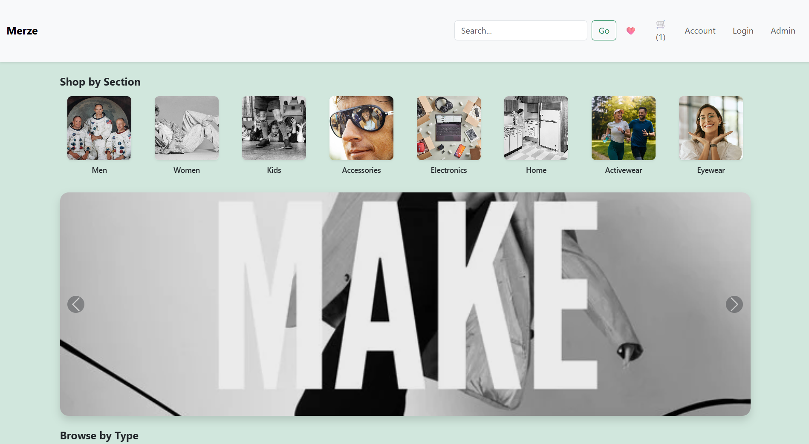
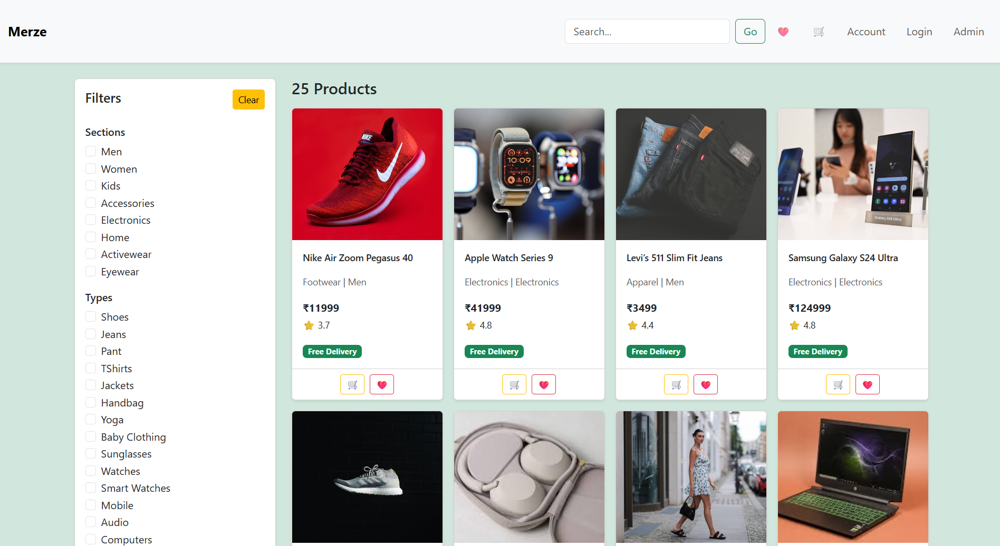
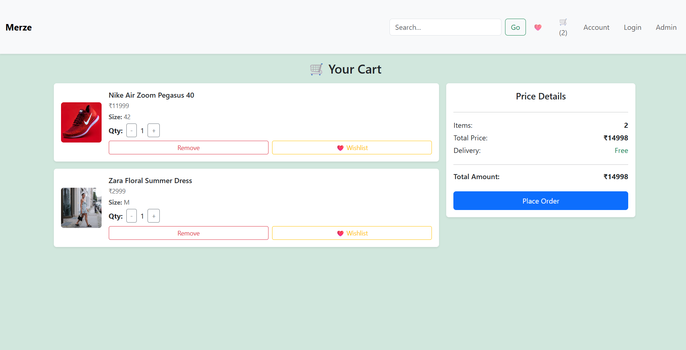

# Merze E-commerce Application

A full-stack e-commerce web application that allows users to browse products, manage a shopping cart, and place orders through a smooth and intuitive interface.
Built to demonstrate real-world frontend–backend integration, reusable UI components, and RESTful API design.

Built with a React frontend, Node.js/Express backend, and MongoDB database.

---

## 🌐 Demo Link  

**Live Demo:** https://my-ecommerce-frontend-dnhsvnqgb-rakeshneopanes-projects.vercel.app/ <br />
**Backend API**: https://my-ecommerce-eta-ruby.vercel.app/

---

## ⚡ Quick Start  

```bash
git clone https://github.com/Rakeshneopane/my-ecommerce-frontend.git
cd my-ecommerce-app
npm install
npm run dev 
```
---

## Technologies
- React JS
- React Router
- Node.js
- Express
- MongoDB
- JavaScript (ES6+)
- REST APIs
- Bootstrap

---

## 🎥 Demo Video

### Watch a walkthrough covering all major features of the e-commerce platform:
- Loom Video Link:  https://www.loom.com/share/25adf0ed43c242d1adc0fad96495302f

---

## ✨ Features

### Product Browsing
- Views a list of all products
- Filters products by section and type
- Views detailed product information

### Cart & Orders
- Adds products to the cart
- Updates product quantity in the cart
- Removes products from the cart
- Places orders with selected address and payment mode

### User Management
- Registers a new user
- Logs in using email
- Views user profile and order history
- Adds, updates, and deletes addresses

### UI & Architecture
- Uses reusable React components
- Implements client-side routing with React Router
- Handles loading, empty, and error states predictably

---

## Environment Setup

### Frontend Environment Variables
Create a .env file in the root of the frontend project.

Example .env
- VITE_API_BASE_URL=https://your-backend-api-url.com

### Backend Environment Variables

Create a .env file in the root of the backend project.

Example .env (Backend) <br />
Required Backend Keys
- PORT = 3000
- MONGODB_URI = mongodb+srv://<username>:<password>@cluster.mongodb.net/merze
- NODE_ENV = development

Description: 
- PORT = "Port number for backend server"
- MONGODB_URI = "MongoDB connection string"
- NODE_ENV= "Application environment"

**Add .env to .gitignore**

### Required Environment Variables
Key :
- VITE_API_BASE_URL	<br/>
Description :
- Base URL of the backend API 
Restart the dev server after updating .env

---

## API Endpoints Used
### Products
- GET /api/products – Fetch all products
- GET /api/products/:productId – Fetch product by ID
- POST /api/create-products – Create product (admin)
- POST /api/products/:productId – Update product
- DELETE /api/products/:productId – Delete product
### Sections & Types
- GET /sections – Fetch all sections
- POST /sections – Create section
- GET /types – Fetch all types
- POST /types – Create type
### Users
- POST /api/users – Create a user
- GET /api/users – Fetch all users
- GET /api/user/:id – Fetch user by ID
- DELETE /api/user/:id – Delete user
### Addresses
- POST /api/users/:id/addresses – Add address
- POST /api/users/:userId/addresses/:addressId – Update address
- DELETE /api/users/:userId/addresses/:addressId – Delete address
### Orders
- POST /api/orders – Place an order
### Authentication
- POST /api/auth/login – Login user via email

- Sample Response 
```
{
  "data": [
    {
      "_id": "6904310714d0f05c914f6527",
      "title": "Nike Air Zoom Pegasus 40",
      "price": 11999,
      "category": "Footwear",
      "rating": 3.7,
      "sellerId": "seller_102",
      "stock": 42,
      "section": {
        "_id": "6915ce9f5dcdf96da56681cd",
        "name": "Men",
        "images": [
          "https://media.gettyimages.com/id/1141653922/photo/the-three-crew-members-of-nasas-apollo-11-lunar-landing-mission-pose-for-a-group-portrait-a.jpg?s=612x612&w=0&k=20&c=Aw7OhPFLeFfEaOjuNribMjCpSnIKMK-vmD8iSS0OawM="
        ],
        "__v": 0,
        "createdAt": "2025-11-13T12:27:11.052Z",
        "updatedAt": "2025-11-13T12:27:11.052Z"
      }
  ]
}
```
---

## Screen Shots






---

## Future Improvements
- User authentication (JWT)
- Order history for users
- Payment gateway integration (Stripe / Razorpay)
- Admin dashboard for product & order management
- Guest login

---

## Contact

For bugs, feedback, or feature requests, please reach out to:
📧 rakeshneopane@gmail.com or lucasneopane123@gmail.com
LinkedIn: https://linkedin.com/in/rakesh-neopane

